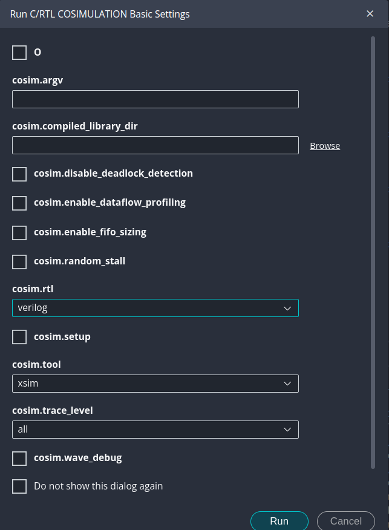

# HLS Quick Cheet

## Table of Contents

- [HLS Quick Cheet](#hls-quick-cheet)
  - [Table of Contents](#table-of-contents)
  - [Context](#context)
  - [FPGA Dev Board:](#fpga-dev-board)
  - [Generating IP Using Vitis IDE](#generating-ip-using-vitis-ide)
    - [HLS component structure](#hls-component-structure)
  - [Testbench](#testbench)
    - [Wavefrom view](#wavefrom-view)

---

## Context

This document represents a reference for the day to day points I use in `HLS`, like IDE features,
board concept,...

It is like a shortcut so I don't need to go to every `.md` file I create.

## FPGA Dev Board:

- Board: [`Basys 3`](https://digilent.com/reference/programmable-logic/basys-3/start?srsltid=AfmBOoqGVJbxlMW3PSAckmjN5O8TFJ62KncVzTbJ7KuzSHw_93Lp0EJg) board from Digilent board
  - FPGA part <-> that is `xc7a35tcpg236-1`
    - `xc7a35t` → Artix-7 FPGA,`cpg236` → Package (236-pin) and `-1` → Speed grade 

## Generating IP Using Vitis IDE

To generate an `IP`, we go through 2 step process using the flow navigator of `Vitis`:

1. `Synthesis` command -> generate RTL code
2. `Package` command -> export RTL as `IP`

### HLS component structure

Takes for example the project `LED_Controller_Vitis`.

 `HLS` component is structured as follows:

 <pre>workspace/component/component/hls/</pre>

 For `LED_Controller_Vitis`:

 <pre>HLS/LED_Controller_Vitis/LED_Controller_Vitis/hls/</pre>
 
 that's why we see `LED_Controller_Vitis` twice.

 Inside `LED_Controller_Vitis` (the 2nd one), we have: 
 
 1. a `hls` folder. This folder contains a `syn` folder which have:
   - `verilog` and `vhdl` folder contains the output of the RTL files
   - `Report` Folder
   - This is from the `Synthesis` result
     - Read [Output of C Synthesis](https://docs.amd.com/r/en-US/ug1399-vitis-hls/Output-of-C-Synthesis) for more information
  
 2. a package named `led_ON.zip`, which takes by default the name of the specified top level function.
    - this comes from `Package` command step
    - read [Reference Packaging Desing](https://docs.amd.com/r/en-US/ug1399-vitis-hls/Packaging-the-RTL-Design) for more details

## Testbench

To run some `xx-tb.cpp` file:

- `C-Simulation`

### Wavefrom view

To show the trace view, we need to do `C RTL Cosimulation`.
When configuring the settings of the cosimulation, under `cosim.trace_level`, select the option `all` as shown in [Figure 1](#fig1)

<strong>Figure 1:</strong> Dump trace option

In `Vitis`, open `C RTL Cosimulation` tab in flow navigator, then open `Report`.
We can choose either `Timeline Trace` or `Wave Viewer`, then `Vivado` open automatically, and we can have for example the Testbench signals

