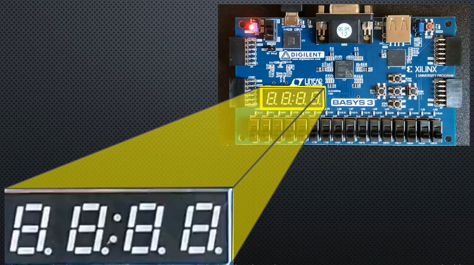
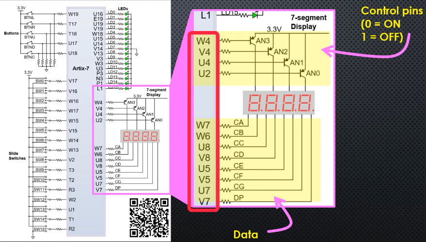
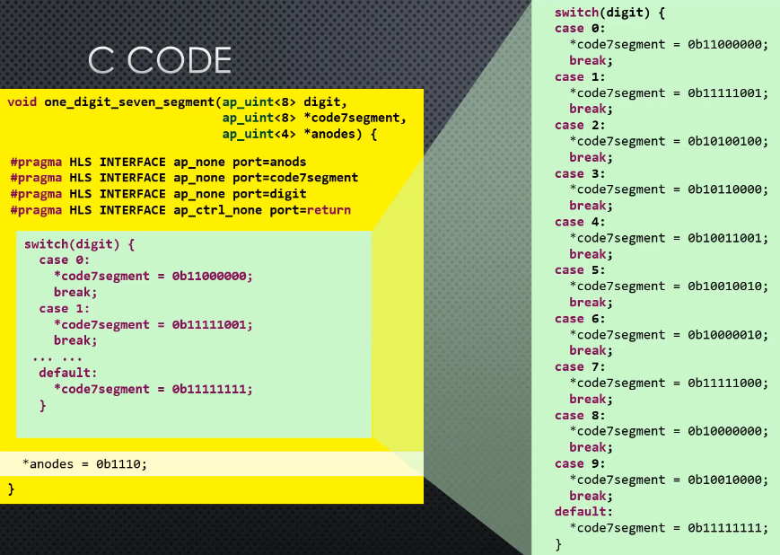
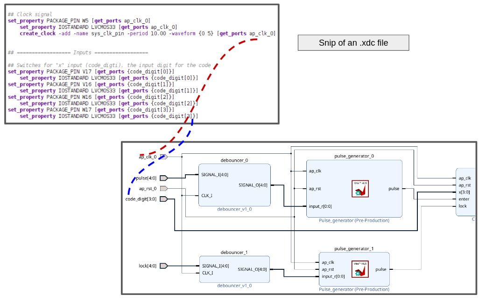

# HLS Quick Cheet

## Table of Contents

- [HLS Quick Cheet](#hls-quick-cheet)
  - [Table of Contents](#table-of-contents)
  - [Context](#context)
  - [FPGA Dev Board:](#fpga-dev-board)
  - [Generating IP Using Vitis IDE](#generating-ip-using-vitis-ide)
  - [Vitis Project Structure](#vitis-project-structure)
  - [Testbench in Vitis](#testbench-in-vitis)
    - [Wavefrom view](#wavefrom-view)
  - [7 Seg on Basy3](#7-seg-on-basy3)
  - [Vivado](#vivado)
    - [Programming FPGA Board](#programming-fpga-board)
    - [Quick tips](#quick-tips)

---

## Context

This document represents a reference for the day to day points I use in `HLS`, like IDE features,
board concept,...

It is like a shortcut so I don't need to go to every `.md` file I create.

## FPGA Dev Board:

- Board: [`Basys 3`](https://digilent.com/reference/programmable-logic/basys-3/start?srsltid=AfmBOoqGVJbxlMW3PSAckmjN5O8TFJ62KncVzTbJ7KuzSHw_93Lp0EJg) board from Digilent board
  - FPGA part <-> that is `xc7a35tcpg236-1`
    - `xc7a35t` → Artix-7 FPGA,`cpg236` → Package (236-pin) and `-1` → Speed grade 

## Generating IP Using Vitis IDE

To generate an `IP`, we go through 2 step process using the flow navigator of `Vitis`:

1. `Synthesis` command -> generate RTL code
2. `Package` command -> export RTL as `IP`

## Vitis Project Structure

Takes for example the project `LED_Controller_Vitis`.

 `HLS` using `Vitis` component is structured as follows:

 <pre>workspace/component/component/hls/</pre>

 For `LED_Controller_Vitis`:

 <pre>HLS/LED_Controller_Vitis/LED_Controller_Vitis/hls/</pre>
 
 that's why we see `LED_Controller_Vitis` twice.

 Inside `LED_Controller_Vitis` (the 2nd one), we have: 
 
 1. a `hls` folder. This folder contains a `syn` folder which have:
   - `verilog` and `vhdl` folder contains the output of the RTL files
   - `Report` Folder
   - This is from the `Synthesis` result
     - Read [Output of C Synthesis](https://docs.amd.com/r/en-US/ug1399-vitis-hls/Output-of-C-Synthesis) for more information
  
 2. a package named `led_ON.zip`, which takes by default the name of the specified top level function.
    - this comes from `Package` command step
    - read [Reference Packaging Desing](https://docs.amd.com/r/en-US/ug1399-vitis-hls/Packaging-the-RTL-Design) for more details

## Testbench in Vitis

To run some `xx-tb.cpp` file:

- `C-Simulation` from the flow navigator

### Wavefrom view

To show the trace view, we need to do `C RTL Cosimulation`.
When configuring the settings of the cosimulation, under `cosim.trace_level`, select the option `all` as shown in [Figure 1](#fig1)

<strong>Figure 1:</strong> Dump trace option

In `Vitis`, open `C RTL Cosimulation` tab in flow navigator, then open `Report`.
We can choose either `Timeline Trace` or `Wave Viewer`, then `Vivado` open automatically, and we can have for example the Testbench signals

## 7 Seg on Basy3 

Some quick information for the 7 Seg on Basys 3 board

- `Basys3` comes with 4 7-segment digit display

<strong>Figure 2:</strong> 7 Seg on Basys 3

- Pins configuration shown in [Figure 3](#fig3)

<strong>Figure 3:</strong> 7 Seg pins config

  - 12 pins are dedicated for the 4 7-seg:
	  - 4 pins for controls, where we have transistors acting a switch 
  	- 8 pins for data lines, shared among the 4 7-seg

- `HLS` code to turn 1 digit code via a set of switches
  

<strong>Figure 4:</strong> HLS code for 1 digit

  - the `*anodes = 0b1110`, means we are enabling the digit on the right
  - The leds on `Basys3` are in common anode configuration, meaning we need `0` to turn a LED ON.

## Vivado 

### Programming FPGA Board

In this section I wirte the general steps to use `Vivado` to configure certain `IP`, and dowaloading them to the FPGA and run the circuit.

<u>Note:</u>

- These steps are taken from [`LED_Controller.md` — Vivado and Generating Bitstream file](LED_Controller.md#vivado-and-generating-bitstream-file),
- Refer to this file for more informations (images,...)

<u>General Steps:</u>

1.**Import `IP` generated by `Vitis`**

- Under flow navigator, in `IP Integrator`, click on  `Create Block Design`
  - A diagram will be opened
  - Under `Project Manager`, click on `Settings`
    - Select `IP`->`Repository`
    - then click on the `plus` logo, and navigate to the workspace where the `IP` pacakge was generated

`Vivado` detects all the `IP` generated in this workspace

2. **Adding External Connections**

- Right click on variable and click on `Make External`
  - This will add a connection to the port

3. **Adding Pyhisical Constraints**

- Under `Block Desgin`, in `Sources` tab, click on `Constraints->Add Sources`
- Select on `Add or create constraints`
- We create a file called as example `LED_Controller.xdc`
- From `Basys3_Master.xdc`, we copy and past the resources we need
  - Inputs: swithces, buttons
  - Outputs: LEDs, 7 segment,....
  - Clock:...

4. **Generating Internal Files and HDL Wrapper**

- Under `Sources`, right click on the block diagram file name (example `LED_Controller.bd`) 
  - `Generate Output Products`
  - Then right click again `Create HDL Wrapper` 

5. **Generating Bitstream File**

- In the flow navigator section, under the `PROGRAM and DEBUG`, click on `Generating Bitstream`

6. **Flashing the FPGA <-> Downloading Bitstream file to the FGPA**

- Connect the board to the computer via a micro USB cable
- In `Flow Navigator` section, under `Program and Debug` section, click on  `Hardware Manager -> Open Target -> Auto Connect`
  - We should see the FPGA board
- Right Click on FPGA name `xc7a35t_0` and select `Program Devices`
  - you should see the bitstream file `LED_Controller_wrapper.bit` directly selected for you

### Quick tips

- We can't rename some input or output port in `Vivado` unless we click on `Make External Connection`.
- Make sure that all the clocks are connected in case of using multiple `IP`
- After finishing with `IP`, next step is the constraint file (see [Figure 5](#fig5))
  - always change names after `get_ports`
  - the names should be the same as in the `external_connections` in the block diagram

<strong>Figure 5:</strong> .xdc file naming

