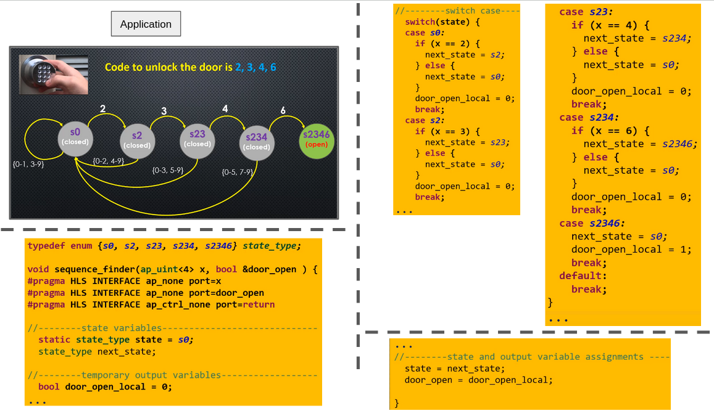
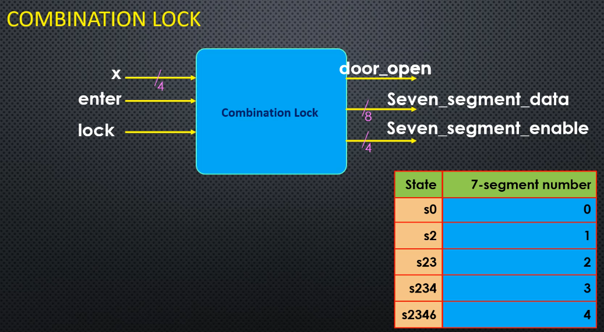
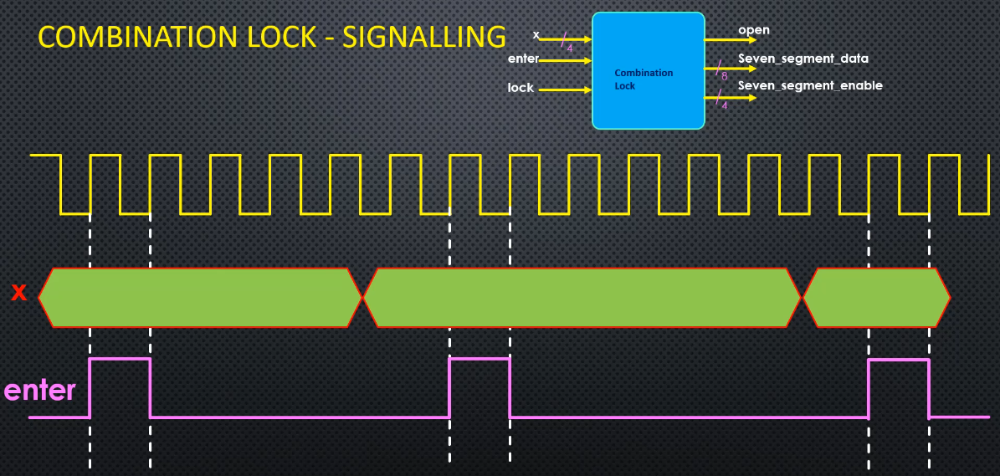
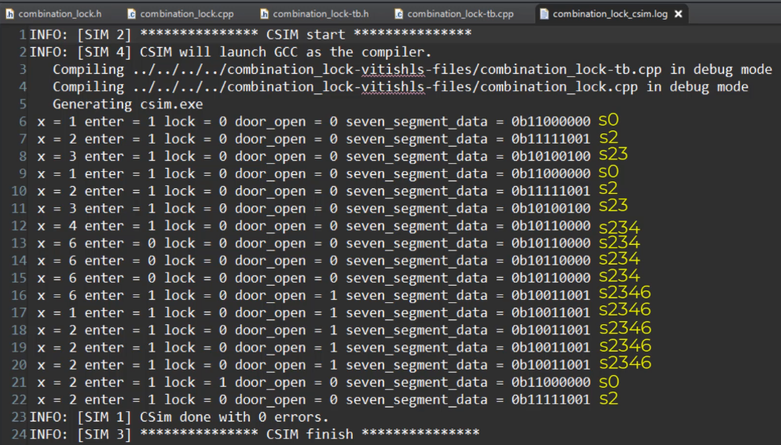
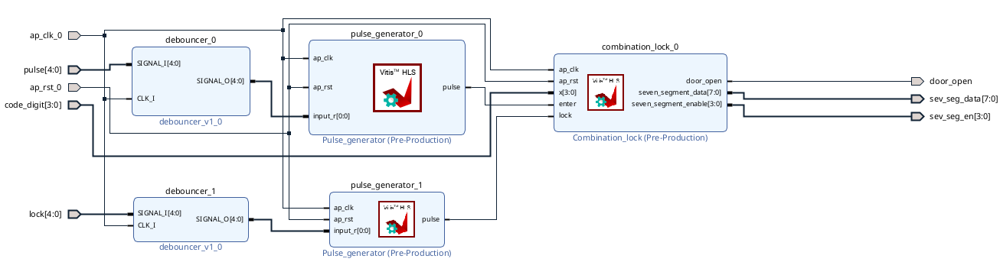

# Combination Lock in FSM

## Table of Contents

- [Combination Lock in FSM](#combination-lock-in-fsm)
  - [Table of Contents](#table-of-contents)
  - [Lab Context](#lab-context)
    - [Projects](#projects)
  - [System Description](#system-description)
    - [Reminder](#reminder)
    - [Extra IO](#extra-io)
  - [Code Description](#code-description)
    - [Top function](#top-function)
    - [Tb files](#tb-files)
  - [Vivado](#vivado)
  - [General Observation](#general-observation)
    - [Sequential Thinking vs Hardware Reality](#sequential-thinking-vs-hardware-reality)
  - [TODO](#todo)

## Lab Context

This doc represents the project for sequence finder implemented using FSM.

Refer to chapter `Finite State Machine` in the reader.

### Projects

`Comb_Lock_Vitis` and `Comb_Lock_Vivado`.


## System Description

1st we proceed to describe the system we want to implement from a qualitative way. There is a section contains a reminder about the system from report (state diagram and `HLS` code), then we move to describe some more details regarding input and output we didn't mention in the reader.

### Reminder

[Figure 1](#fig1) contains state diagram along with `HLS` code

<div id="fig1">

<p><strong>Figure 1:</strong> Sequence finder: state diagram and HLS code</p>
</div>

Recall that when launching the circuit on the FPGA board, the input sequence is inputted in binary via the switches as shown in [Table 1](#tab1)

<div id="tab1">

| Decimal | Binary (4-bit) |
|---------|----------------|
| 2       | `0010`         |
| 3       | `0011`         |
| 4       | `0100`         |
| 6       | `0110`         |

<p><strong>Table 1:</strong> Decimal to binary equivalent for the password digits</p>
</div>


### Extra IO

In order to implement this circuit in `Vitis`, we add 2 extra inputs and outputs as shown in 
[Figure 2](#fig2)

<div id="fig2">

<p><strong>Figure 2:</strong> Combination lock IO</p>
</div>

- `enter`:determines the validation of the number on the `x` input
  - In other words, it tells the state machine that the input data is ready and valid to be sampled 
- `lock`: reset the state machine and put the state at `s0`
- `seven_seg` to shows the index of the state
  - these are added for debugging, and understanding the circuit behaviour

<u>Note about `lock` variable :</u>

- when we say `lock` reset the state machine to `s0`, we mean in the sense only when open the safe (so we reach the last state), we want to close it again
- we don't mean it in the sense that we want whenver we are at any state, we are able to reset the machine
  - this means we are continously checking for `lock` at all the cases, and that's not the desing we want


<u>Input Connections</u>

The inputs `x` and `enter` are related as shown in [Figure3](#fig3)

<div id="fig3">

<p><strong>Figure 3:</strong> Input relation</p>
</div>

- `x` input is connected via slide switches, so we can give new value to `x`.
- `enter` to push buttons
  - So whenever we press `enter`, a single pulse is detected by the state machine, and read the value of `x`


## Code Description

We proceeed in this section to explain some pieces of the code

### Top function

Each `case` in the `switch` statement follows the same logic, illustrated here with `case s0`:

```cpp
case s0:

    if (enter == 1) {
    // pulse detected, ready to ready input "x"	
        if (x == 2) {
            next_state = s2;
        } else {
            next_state = s0; // reset, wrong number in the password
        }

    } else {
        // no pulse detected, hold at the current state
        next_state = s0;
        door_open_local = 0;
    }
    
    break;
```

The general rule for how each `case` works:

- `enter == 1`
  - `enter` is connected to a push button to simulate 1 pulse cycle
  - `enter == 1`: we are now ready to read the `x` (digit) number
  - `enter != 1`: no pulse detected → `next_state` = current state, no reset

- `x == ` some number in `{2, 3, 4, 6}`
  - if `true` → `next_state` = next state in the state diagram of [Figure 1](#fig1)
  - if `false` (wrong password) → reset to `s0`


### Tb files

The `tb` file are used to shown if for a certain input, we have the correct transition state as shown in [Figure 4](#fig4)

<div id="fig4">

<p><strong>Figure 4: </strong>Tb file role</p>
</div>


## Vivado 

Aside from the generated IP using the `HLS` code, we will use extra helper `IP` as shown in [Figure 5](#fig5)

<div id="fig5">

<p><strong>Figure 5: </strong>Comb Lock IP</p>
</div>

- Variables `enter` and `lock` are simulated both using a **push button***.
  - `enter` is assigned to pin `U18` (center button on FPGA board)
  - `lock` is assigned to pin `T18` (upper button on FPGA board)

- A push button needs to generate a single cycle pulse (as in [Figure3](#fig3)). This is done using 2 `IP`:

  - a `pulse_generator` to generate the singel cycle pulse
  - a `debouncer` to eliminate the glitches

## General Observation

When running the system on the FPGA board:

1. we set some switch to input `x` (in binary according to [Table 1](#tab1))
2. then we press `enter` implemented by a push button 
   - pin `U18` (center button on FPGA board) 


For the function `ap_uint<8> get_seven_segment_code(state_type number)`: 

- it converts a state to 7 seg (as in table of [Figure 2](#fig2))
- it is called only **at the end** when we get the final state updated and saved as `state = next_state;`
  - and not at the end of each `case`, so no similar in a software approach
  - this is more the hardware and FPGA approach, read [seq think vs hardware](#sequential-thinking-vs-hardware-reality)

### Sequential Thinking vs Hardware Reality

In `top_comb_lock.cpp` file, we are implementing the sequence finder using `HLS` code, so our mind is simulating the code in a sequential manner, which means we press `enter` then set some switch for input `x`, but this not the case.

When reading `HLS` code, the brain naturally executes it line by line, which creates a false impression of ordering between signals.

But on the FPGA, at the rising clock edge, **all input signals are sampled simultaneously**: inputs `x` and `enter` arrive at the circuit at the exact same moment. There is no "before" or "after" between them.

<u>Some key points to keep in mind:</u>

- **One function call = one clock cycle.** In the testbench, writing `x = 2; enter = 1;` before the call is just setting signal values. The actual "hardware moment" is the function call itself, where everything is evaluated together in one clock cycle.

- **The `static` keyword is the hardware memory.** The only thing that survives between clock cycles is `static state_type state`. Everything else (`next_state`, `door_open_local`) is purely combinational — computed fresh every cycle. This maps directly to the distinction between registers (flip-flops) and combinational logic in a circuit.

- **`#pragma HLS PIPELINE` enforces this behaviour.** It tells the HLS tool to accept new inputs every clock cycle, making the function behave like a continuously running circuit rather than a one-shot computation.

- **"Parallel" here means synchronous parallel.** Everything happens at once, but only at the clock edge. Between edges, inputs can change freely and the circuit ignores them. This is different from fully asynchronous logic.


## TODO

- run some waveform tracing using the `tb` files to understand more about the nature of the computation executed on the FPGA

Some of the concepts to revisit later:

- inputs `x` and `enter` are sampled at the same moment, at the rising edge of the clock
- `tb` file: 1 function call 1 clock cycle
- to review from labs before the concepts of calling some top function 1 time and not running the system
  - this was in the labs of `Paralle Serial systems`, where we call top function of each module and not activating the system
- do some diagram to understand the concept of `#pragma HLS PIPELINE`
  - do a search about it, ask copilot also about it, and the udemy forum

2nd set of points:

- ask udemy board on the type of state machine
  - melay vs moore
  - do some quick search and document it

- see the bugs for vivado
  - xdc file bugs and naming
  - search history from copilot chat, and try to understand them
  - project configuration in Vivado, mainly about the error for the `HDL wrapper`, it cost me some time to debug it