# LED Controller

## Table of Contents

- [LED Controller](#led-controller)
  - [Table of Contents](#table-of-contents)
  - [Goal](#goal)
  - [Resources](#resources)
  - [Creating Project in Vitis](#creating-project-in-vitis)
  - [Building LED Controller Project](#building-led-controller-project)
    - [Selecting Top Functions](#selecting-top-functions)
    - [Running Simulation](#running-simulation)
    - [Generating IP Package](#generating-ip-package)
  - [Vivado and Generating Bitstream file](#vivado-and-generating-bitstream-file)
    - [Creating a projects in Vivado](#creating-a-projects-in-vivado)
    - [Exporting IP to Vivado](#exporting-ip-to-vivado)
    - [Adding External Connection](#adding-external-connection)
    - [Adding Pyhisical Constraints](#adding-pyhisical-constraints)
    - [Generating Internal Files and HDL Wrapper](#generating-internal-files-and-hdl-wrapper)
    - [Generating Bitstream File](#generating-bitstream-file)
  - [Flashing the FPGA \<-\> Downloading Bitstream file to the FGPA](#flashing-the-fpga---downloading-bitstream-file-to-the-fgpa)

## Goal

This document illustrate the `LED_Controller`, as it plays the role of hello world project in HLS.

The code for turning LED is straightforward, so we focus more on the development environment which are: `Vitis` (for writing HLS code), and `Vivado` (for generating bitstream file and programming the FGPA board)

## Resources

[Vitis User Guide](https://docs.amd.com/r/en-US/ug1399-vitis-hls/Building-and-Running-an-HLS-Component)

- Provide an explanation about the `Vitis` IDE used in `HLS`

## Creating Project in Vitis

1. `File`->`New Component`->`HLS`
   1. Then we give our project or component a name, as shown in [Figure 1](#fig1)

    

    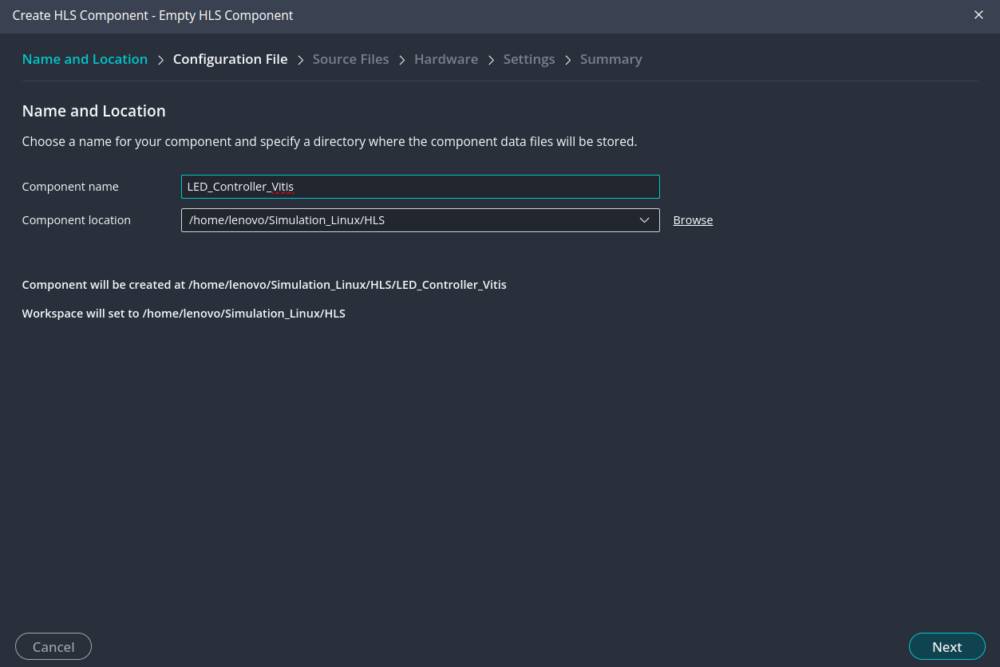
    
<strong>Figure 1:</strong> Project Name

    

2. Top Function
   1. In the `Source file` shown in [Figure 2](#fig2)

    

    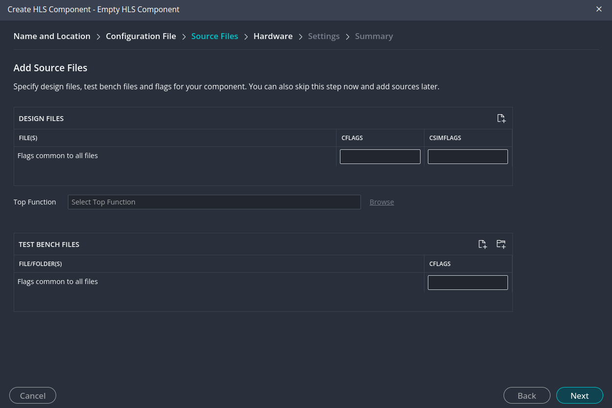
    
<strong>Figure 2:</strong> Top function

    

    2. **Each hardware module or each project can have 1 top function**, and the other function will be called in some hiearchy from this top function

    3. If we don't know what is the name of the top function, we can skip it and leave it empty, then specify it later
       1. I will do this to show how we can do this from inside `Vitis`

3. Now specfiy our target

    

    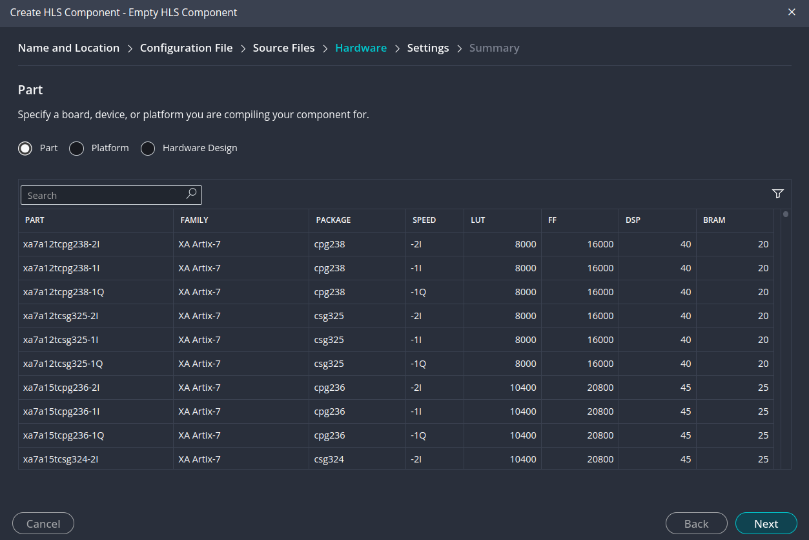
    
<strong>Figure 3:</strong> Target

    

    1. Since we working with `Basys 3` board, we enter directly the name of the FPGA part <-> that is `xc7a35tcpg236-1`
       1. `xc7a35t` → Artix-7 FPGA,`cpg236` → Package (236-pin) and `-1` → Speed grade 

 4. Finally, we specify some general settings, such as the clock rate,...

    

    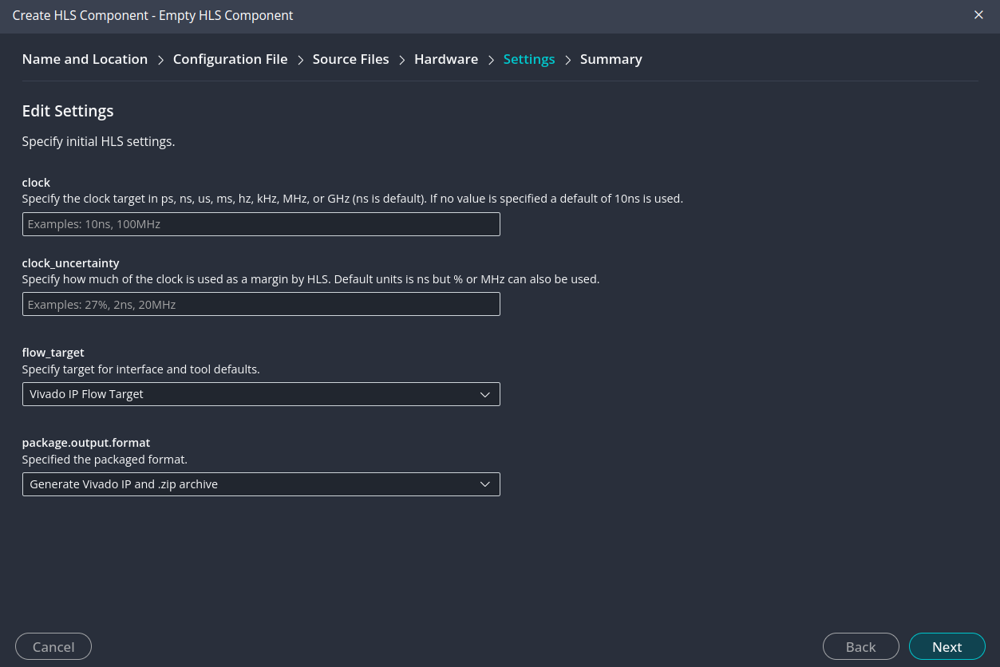
    
<strong>Figure 4:</strong> General Settings

    

    1. since we workign with comibinational logic, we can skip this part for now

After finishing this steps, inside the `LED_Controller_Vitis`, we will have some generated file as shown in [Figure 5](#fig5)

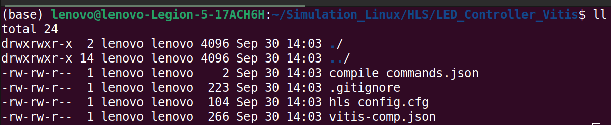

<strong>Figure 5:</strong> Generated Files

## Building LED Controller Project

Now we have `LED_Controller` created, we see now how to implement the code, and generate the `IP` pacakge.

<u>Note:</u> read [Launching Vitis IDE](https://docs.amd.com/r/en-US/ug1399-vitis-hls/Launching-the-Vitis-Unified-IDE), section `Features of the Vitis Unified IDE` , to see different sections of the `Vitis` IDE. The important sections for us are:

1. The component explorer
   1. enable us to see our workspace, hierachy in each project
2. The flow navigator (directly beneath the component explorer)
   1. we can run each step of the desing from it
   2. And usually we use it allot to run our code, generating our `IP`,...

### Selecting Top Functions

After implementing our code, it is necessary to select our function `void led_ON(unsigned char *o)` as a **top funciton** before running the simulation.

We can do it from `component explorer`, by clicking `Setting`-> `hls_config.cfg`, then under `General`, we scroll down till we find `top` option, and we hit `browse` to select our top function. These steps are shown in [Figure 6](#fig6).

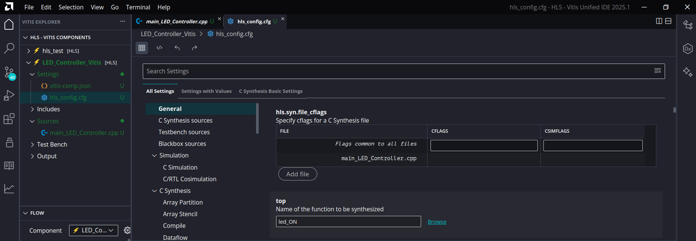

<strong>Figure 6:</strong> Selecting top function in project LED_Controller

### Running Simulation

Now we can simulate our code, by pressing `Synthesis` option from `Flow Navigator`. This will generate the RTL code, and from it we can generate our `IP`.

Under `C SYNTHESIS` in the flow navigator, we can see a REPORT for our synthesis, and we can read that we have 1 port `o`, having `ap_none` mode (protocole)

<u>Note:</u> Once synthesis is finished, the directory hierarchy for the `LED_Controller_Vitis` is shown in [Figure 7](#fig7) 

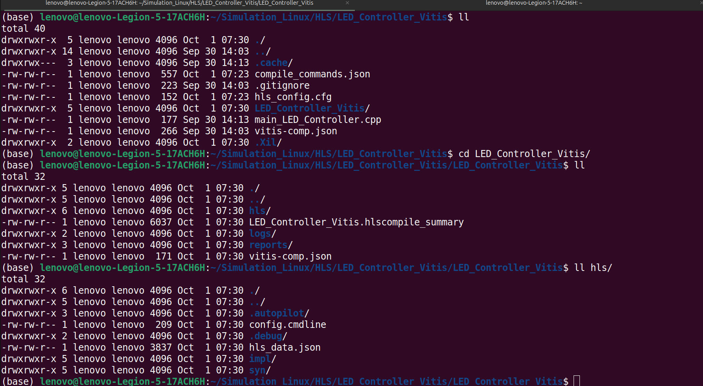

<strong>Figure 7:</strong> LED_Controller Component directory hierarchy 

In general, `HLS` component is structured as follows: workspace/component/component/hls/, that's why we see `LED_Controller_Vitis` twice. Inside `hls` directory, there is a `syn` folder containing:
- `verilog` and `vhdl` folder contains the output of the RTL files
- `Report` Folder

Read [Output of C Synthesis](https://docs.amd.com/r/en-US/ug1399-vitis-hls/Output-of-C-Synthesis) for more information.

### Generating IP Package

The final step in the HLS component flow is to package the RTL design into a form that can be used by other tools in the design flow, such as in the Vivado Design Suite as part of a larger system design.

Click the `Package` command in the Flow Navigator to export the RTL as a `Vivado IP`.

Inside `LED_Controller_Vitis` (the 2nd one), we will have a package named `led_ON.zip`, which takes by default the name of the specified top level function.

<u>Note:</u> See [Reference Packaging Desing](https://docs.amd.com/r/en-US/ug1399-vitis-hls/Packaging-the-RTL-Design) for more details.

## Vivado and Generating Bitstream file

Once we have the `IP` ready, we need to connect this `IP` into FPGA pins. In our case, our `IP` is composed from an array of 8 signals, as shown in [Figure 8](#fig8)

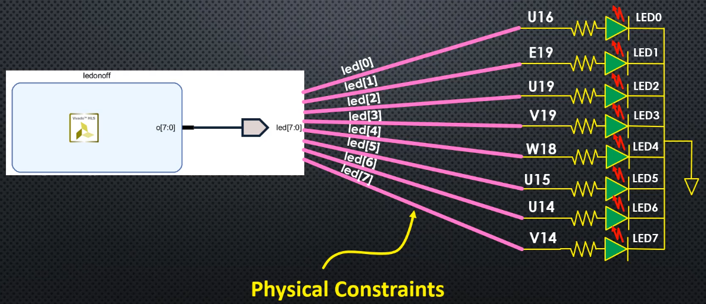

<strong>Figure 8:</strong> Mapping IP port to FPGA Pins 

This connection is done via the concept of **constraints**, that is the mapping (physicall location and electrical charactrestics) for each port (LED, switches,7 segement,...).

This mapping is provided by some constraint file of extension `.XDC` provided by the FPGA vendor

### Creating a projects in Vivado

Creating project is straightoforward. Just pay attention in `Project Type` step shown in [Figure 9](#fig9), to select the option Do not specify sources at this time.

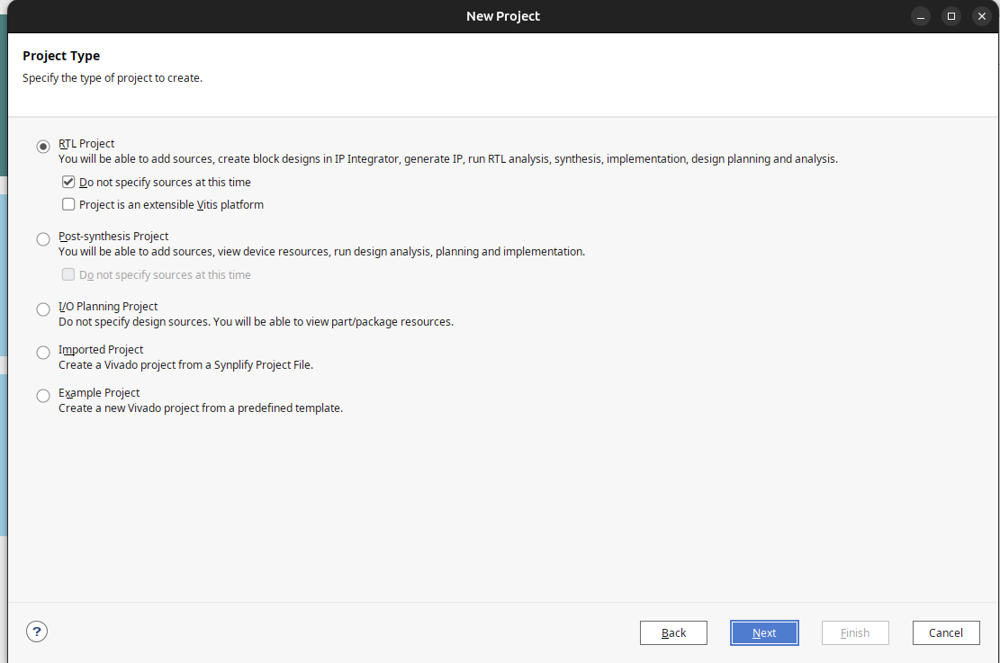

<strong>Figure 9:</strong> Project Type 

### Exporting IP to Vivado
<u>Steps:</u>

1. Under flow navigator, in `IP Integrator`, click on  `Create Block Design`
   1. A diagram window will be opnened
2. Then Under `Project Manager`, click on `Settings`
   1. Select `IP`->`Repository`
   2. then click on the `plus` logo, and navigate to the workspace where the `IP` pacakge was generated
3. `Vivado` detects all the `IP` generated in this workspace (see [Figure 10 ](#fig10))

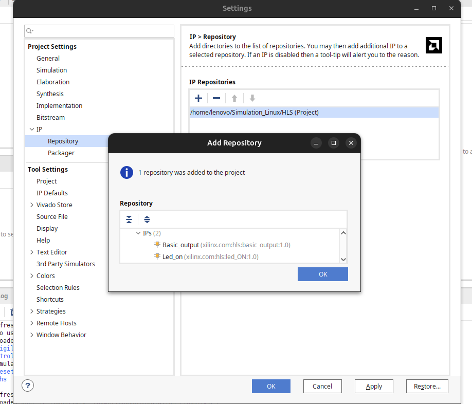

<strong>Figure 10:</strong> IP detection 

4. Once `IP` are added to the project, we can hit again the `plus` sign on the `Diagram` windwo, and search for the `IP` needed
   1. By default, it takes the name of the top level function when it was geenerated by `Vitis`
   2. In our case its name `led_on` (see [Figure 11](#fig11))

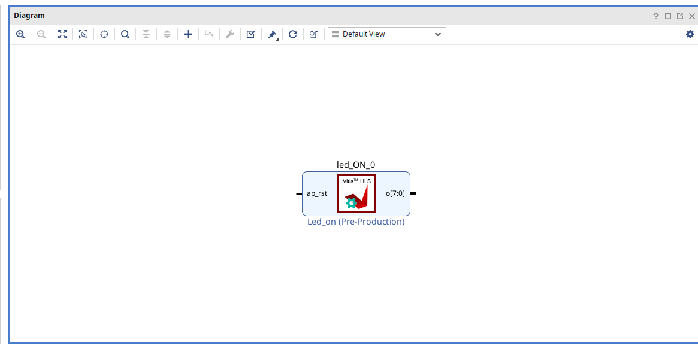

<strong>Figure 11:</strong> IP led_on inserted 

### Adding External Connection

5. Our `IP` in [Figure 11](#fig11) has 1 output port. 
Right click and click on `Make External`
   1. This will add a connection to the port
   2. Also we can rename to our port using `External Port Properties` to a more suitable name (see [Figure 12](#fig11))

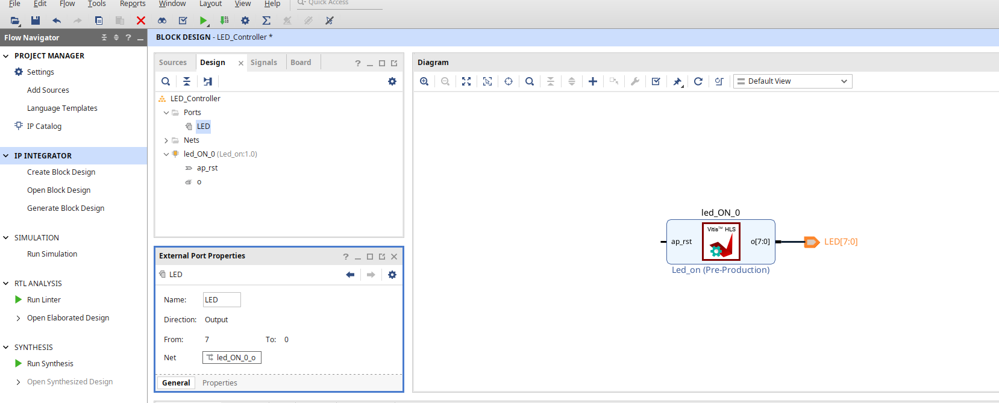

<strong>Figure 12:</strong> Adding connection point to the port 

### Adding Pyhisical Constraints

Now we need to connect the output port `LED[7:0]` to the FPGA pins. This will be done by adding physical contraint file

   1. Under `Block Desgin`, in `Sources` tab, click on `Constraints->Add Sources`
   2. Select on `Add or create constraints`
   3. We create a file called  `LED_Controller.xdc`
   4. The `LED_Controller.xdc` file will now be available under `Constraints_1` under `Sources` tab 
   5. From `Basys3_Master.xdc`, we copy and paste to `LED_Controller.xdc` 1st 8 led (from 0->7) in the `.xdc` file, and we change the name from `led` to `LED`, so the `.xdc` file contains the same port name of our `IP`

### Generating Internal Files and HDL Wrapper

Under `Sources`, right click `LED_Controller.bd`
1. `Generate Output Products` 
   1. this creates some internal files required for the Vivado workflow
2. Then right click again and select for `Create HDL Wrapper`.
   1. This create a top file that encompasses all our desing
 
### Generating Bitstream File

   1. In the flow navigator section, under the `PROGRAM and DEBUG`, click on `Generating Bitstream`
   2. The bit stream file location will be at:

   <pre>LED_Controller_Vivado/LED_Controller_Vivado.runs/impl_1/LED_Controller_wrapper.bit</pre>

   3. The general syntax is:

   <pre>project_name/project_name.runs/impl_1/project_name_wrapper.bit</pre>

## Flashing the FPGA <-> Downloading Bitstream file to the FGPA

There are 5 steps to program an FPGA once the bitstream file is generated. These steps are shown in [Figure 13](#fig13)

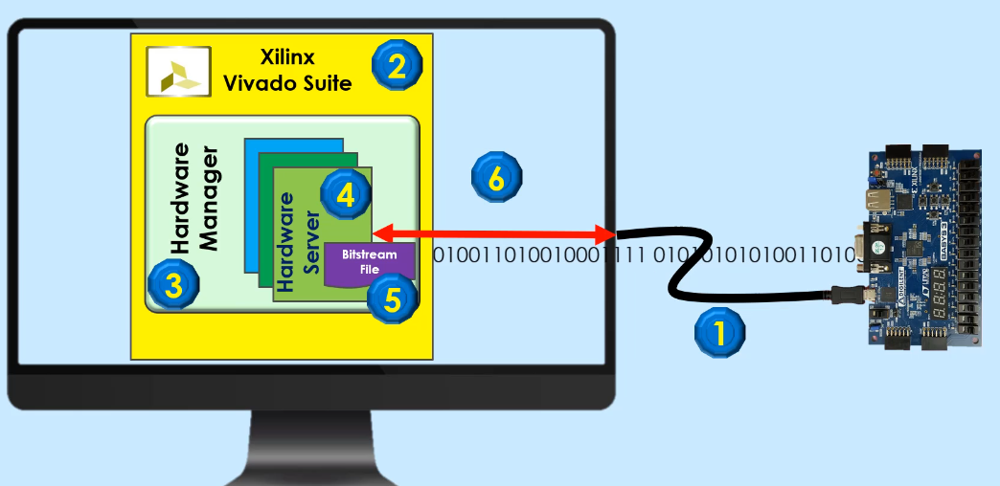

<strong>Figure 13:</strong> Programming FPGA Steps 

1. Connect the board to the computer via a micro USB cable
2. Open the project using `Vivado`
   1. `Vivado` use files with `.xpr` extension
   2. Mine is `LED_Controller_Vivado.xpr`
3. In `Flow Navigator` section, under `Program and Debug` section, click on  `Hardware Manager -> Open Target -> Auto Connect`
   1. We should see the FPGA board as shown in [Figure 14](#fig14)

   

   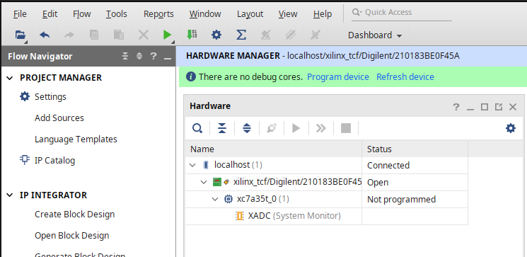
   
<strong>Figure 14:</strong> FPGA Board Connected 

   

4. Right Click on FPGA name `xc7a35t_0` and select `Program Devices`
   1. you should see the bitstream file `LED_Controller_wrapper.bit` directly selected for you
   2. if not, select the proper one (see step 2 and 3 in [Generating Bitstream File](#generating-bitstream-file))
