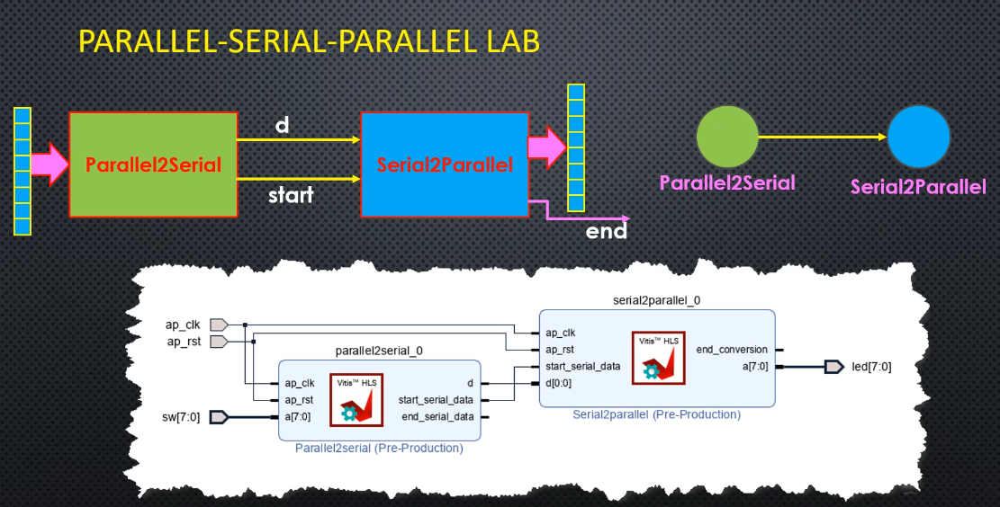
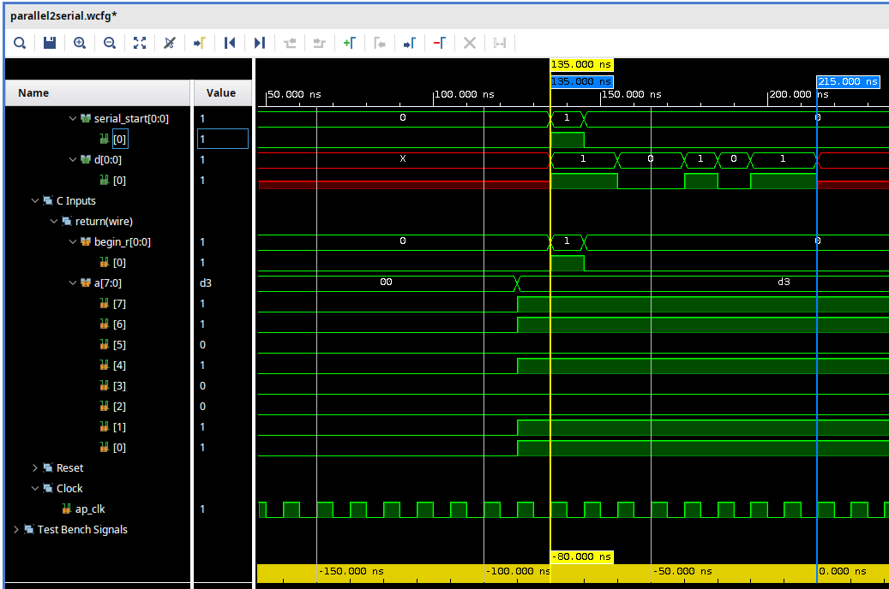
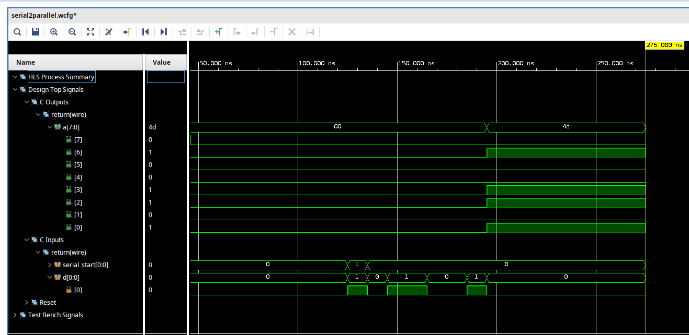
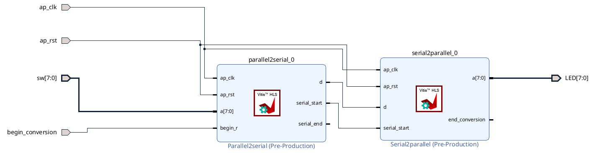

# Parallel Serial System

## Table of Contents

- [Parallel Serial System](#parallel-serial-system)
  - [Table of Contents](#table-of-contents)
  - [Context](#context)
  - [System parameters](#system-parameters)
  - [Parallel to Serial](#parallel-to-serial)
    - [Time trace view](#time-trace-view)
  - [Serial to Parallel](#serial-to-parallel)
    - [Order of bits of type ap\_uint\< N \>](#order-of-bits-of-type-ap_uint-n-)
  - [Comparison between Parallel to Serial and Serial to Parallel](#comparison-between-parallel-to-serial-and-serial-to-parallel)
    - [Notes for rendering HTML table](#notes-for-rendering-html-table)
  - [Vivado](#vivado)

---

## Context

This document contains simulation and explanation about
`Serial_to_Parallel_Vitis` and `Parallel_to_Serial_Vitis`.

[Figure 1](#fig1) contains the lab context

<strong>Figure 1:</strong> Paralle Serial lab context

- 1st we generate each system alone using `vitis`
- Then we integrate the 2 `IP` into a 1 system using `Vivado`
- This sytem takes some switch input and convert display this // output on LEDs

## System parameters

- `N` number of bits
- `a`: input/output of type `ap_uint<N>` equal to `1101 0011`
- `d` is input/output of type `bool`

## Parallel to Serial

### Time trace view

[Figure 2](#fig2) presents the time trace for parallel to serial system:

<strong>Figure 2:</strong> Time trace view for parallel to serial

<u>Some Notes: </u>

- `a` the **input**, is coming through 8 bit parallel port
  - this mean in the simulation, **every bit**  of `a` **is present through all the clock period**
- whereas `d` the output, is serial
  - 1 bit in each clock period, we see  of `d`
  - <u>Output bits order</u>:
    - 1st bit is the LSB and
    - last bit of `d` is the MSB

## Serial to Parallel

Now we move to the opposite system, the serial to paralle one.

[Figure 3](#fig2) present the time trace for serial to parallel system:

<strong>Figure 3:</strong> Time trace view for serial to parallel

- To obtain the results of [Figure 3](#fig3), run `serialtoparallel-tb.cpp` file.

The main steps inside the `tb` file are:

1) we have our test data `data = 0b1001101`, having `N` bits
2) the input is `d` of type `bool`
   - `d` is of type bool since the circuit expect 1 bit at each clock cycle

3) we call our function `serial2parallel()` **N** times
   - at each iteration, we select one input from `data`<->`d = data[i]`
   - we give it to `serial2parallel()`, we obtain 1 paralle bit of output `a`

### Order of bits of type ap_uint< N >

- When selecting some bits inside a `for` loop using expression such as `d = data[i]`, the LSB is selected 1st
- it is different then array data structure, like `data[0] = 1` from LSB side, and not from MSB side
- this why at `i=0`, we see at the trace in [Figure 2](#fig2) `a[0]=1` from LBS side

## Comparison between Parallel to Serial and Serial to Parallel

Let `N` denote the number of bits

|  | **Parallel to Serial** | **Serial to Parallel** |
|---|---|---|
| **1) Input / Output** | **`a`** input — type `ap_uint<N>` : all bits appear in every clock cycle  **`d`** output — type `bool` : 1 bit per clock cycle | **`d`** input — type `bool` : 1 bit per clock cycle  **`a`** output — type `ap_uint<N>` : all bits appear in every clock cycle |
| **2) Output bits order** | LSB first | Parallel type — all bits appear at the same clock cycle |
| **3) HLS code** | - Compare state variable `count` - Output `d = a[count++]` &nbsp;&nbsp;- Update applied for all cases of N: &nbsp;&nbsp;&nbsp;&nbsp;- `count == 0` → 1st bit &nbsp;&nbsp;&nbsp;&nbsp;- `count < N-1` → in between &nbsp;&nbsp;&nbsp;&nbsp;- `count == N-1` → last bit | - Based on **state shifting** - Since `a` (the output) is parallel, output is only updated on the **last bit** |

### Notes for rendering HTML table
- `  `: used for line breaks inside table cells

## Vivado

[Figure 4](#fig4) shows the `vivado` experiment using `IP` for parallel to serial and serial to parallel

<strong>Figure 4:</strong> Vivado experiment for Parallel serial system

- The system takes 8 switches as parallel input, convert them to serial and then turn them back to parallel data and displaying them on LED
- In the `parallel_sys.xdc` file, `begin_conversion` is assigned to pins `T18`, where this pin represent the upper botton on the `Basys3` board
  - It can be seen that `T18` is marked down on the upper button
- This means for example for any switch on, we have the correspondent LED on
  - `sw[0]` ON -> `LED0` ON
  - `sw[0],sw[3]` ON -> `LED[0],LED[3]` ON
  - ...
- Any time we use a new switch , we need to press on the upper button of pin `T18`

