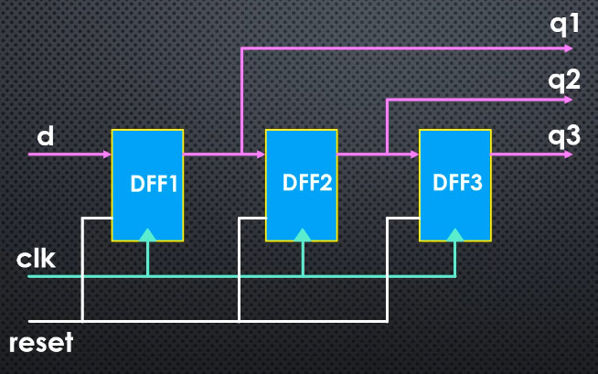
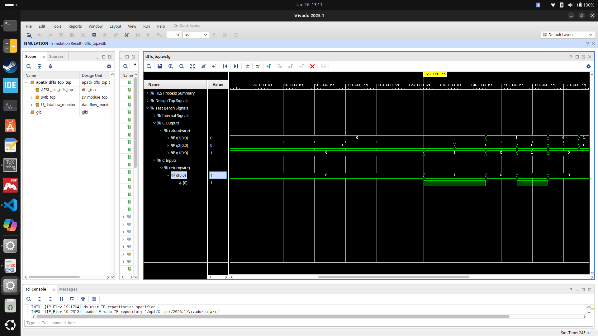
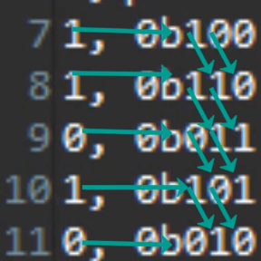

# D-FF series project

## Table of Contents

- [D-FF series project](#d-ff-series-project)
  - [Table of Contents](#table-of-contents)
  - [Design Given](#design-given)
  - [Waveform view using Vitis and Vivado](#waveform-view-using-vitis-and-vivado)
  - [Testbench as waveform](#testbench-as-waveform)

## Design Given

The goal is to implement an `HLS` code of the design shown in [Figure 1](#fig1).

<strong>Figure 1:</strong> Design Given

The desing has 1 binary input `d`, and 3 output `q1` -> `q3`.

## Waveform view using Vitis and Vivado

To show the trace view, we need to do `C RTL Cosimulation`.
When configuring the settings of the cosimulation, under `cosim.trace_level`, select the option `all` as shown in [Figure 2](#fig2)

<strong>Figure 2:</strong> Dump trace option

In `Vitis`, open `C RTL Cosimulation` tab in flow navigator, then open `Report`.
We can choose either `Timeline Trace` or `Wave Viewer`, then `Vivado` open automatically, and we can have for example the Testbench signals, for input (`d`), and output for `q1`,`q2` and `q3`.

[Figure 3](#fig3) shows the testbench signal with a start time of 125 ns.

<strong>Figure 3:</strong> Wave view in Vivado

## Testbench as waveform

In this project, the `tb` files are served as input for waveform views, in which we give the input `d` some value, we call the top function, and then capture the output `qn`.

[Figure 4](#fig4) shows the output of `dffs_register-tb.cpp` in `d_ff_3_reg`(using multibit static variable approach)

<strong>Figure 4:</strong> Testbench output

